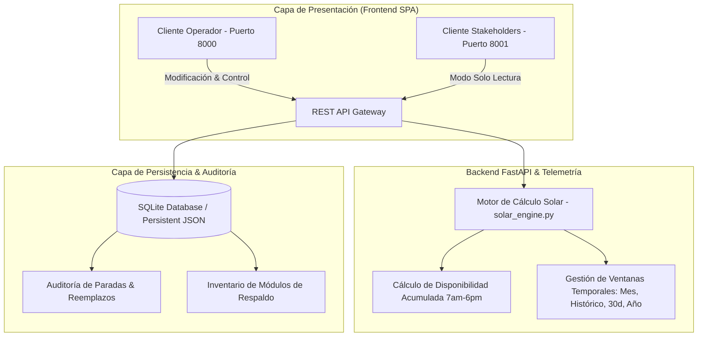

# SOLARIS CONTROL MOD ☀️⚡


-amber.svg)
-indigo.svg)


**SOLARIS CONTROL MOD** es una plataforma industrial de grado empresarial diseñada para el monitoreo, la telemetría operacional, la auditoría de paradas por mantenimiento y la gestión de rotación de módulos de potencia en plantas solares fotovoltaicas.

El sistema supervisa las unidades inversoras de las subplantas **Palmaseca 1** (Inversores `A1`, `A2`, `B1`, `B2`) y **Palmaseca 2** (Inversores `C1`, `C2`, `D1`, `E1`), garantizando el cálculo continuo de disponibilidad porcentual acumulada dentro de la ventana de generación solar efectiva de **11 horas diarias (07:00 AM - 06:00 PM)**.

---

## 🏗️ Arquitectura del Sistema

El sistema implementa un desacoplamiento completo entre la capa de presentación (Single Page Application responsiva en Vanilla JavaScript, CSS Glassmorphic y Chart.js) y la capa de servicios backend (FastAPI, SQLite y motor numérico `solar_engine`).



---

## ⚡ Características Principales

### 1. Dashboard Consolidado & Tarjetas KPI Interactivas
- **Métricas Globale en Tiempo Real**: Visualización inmediata de módulos en operación, paradas en curso, stock de respaldo y horas solares generadas.
- **Navegación Interactiva por Clic**:
  - **Módulos Operativos** ➔ Redirige al *Catálogo General e Inventario*.
  - **En Reparación** ➔ Redirige al *Historial de Paradas Pendientes*.
  - **Módulos de Respaldo** ➔ Redirige al *Inventario de Módulos en Stock*.
  - **Horas Solares Generadas** ➔ Redirige al *Historial Completo*.

### 2. Diagramas de Disponibilidad por Inversor
- **Barras Agrupadas Paralelas**: Muestra visualmente el porcentaje de disponibilidad y la indisponibilidad de cada unidad inversora lado a lado (`stacked: false`).
- **Etiquetas Verticales a 90°**: Rotación numérica exacta dentro o sobre cada barra con precisión de 1 decimal (`XX.X%`).
- **Filtro de Período Temporal**:
  - **Mes Acumulado** *(Por defecto)*: Calculado desde el día 1 del mes en curso.
  - **Histórico Global**: Acumulado integral desde la fecha base inicial (**13 de Agosto de 2026**).
  - **Últimos 30 Días**: Ventana móvil de análisis operacional.
  - **Año en Curso**: Consolidado anual acumulado.

### 3. Gestión de Respaldo e Inventario General
- **Módulos de Respaldo (Spares)**: Control de inventario de unidades listas para sustitución inmediata.
- **Catálogo General de Módulos**: Búsqueda en tiempo real por número de serie, corrección de identificadores y consulta de horas acumuladas de operación.

### 4. Auditoría e Histórico de Paradas Paginado
- **Paginación a 20 Registros**: Restricción de vista a un máximo de 20 filas por página con controles `< Anterior` `Página X de Y` `Siguiente >` para un rendimiento impecable.
- **Exportación en Un Clic**: Generación y descarga directa del historial en formato **CSV**.

### 5. Despliegue Dual Orientado a Roles
- **Puerto 8000 (Operador)**: Control total para registro de fallas, arranques y reemplazos.
- **Puerto 8001 (Stakeholders)**: Interfaz aislada en modo **Solo Lectura** con banner informativo para auditar el estado de la planta sin riesgo de mutación de datos.

---

## 🚀 Instalación y Despliegue Rápido

### Prerrequisitos
- [Docker](https://www.docker.com/) & [Docker Compose](https://docs.docker.com/compose/)
- O bien [Python 3.11+](https://www.python.org/) y `pip` para ejecución local.

### Opciones de Despliegue

#### Opción A: Despliegue con Docker Compose (Recomendado)

1. Clonar el repositorio:
   ```bash
   git clone https://github.com/jhonclavijotro/control_mods.git
   cd control_mods
   ```

2. Iniciar los contenedores docker:
   ```bash
   docker compose up -d --build
   ```

3. Acceder a las aplicaciones:
   - **Consola del Operador**: [http://localhost:8000](http://localhost:8000)
   - **Vista Stakeholders (Solo Lectura)**: [http://localhost:8001](http://localhost:8001)

#### Opción B: Ejecución Local en Python

1. Crear y activar entorno virtual:
   ```bash
   python -m venv venv
   # En Windows:
   .\venv\Scripts\activate
   # En Linux/macOS:
   source venv/bin/activate
   ```

2. Instalar dependencias:
   ```bash
   pip install -r requirements.txt
   ```

3. Iniciar el servidor FastAPI:
   ```bash
   python -m uvicorn backend.main:app --host 0.0.0.0 --port 8000 --reload
   ```

---

## 🛠️ Referencia de API REST

| Método | Endpoint | Descripción |
| :--- | :--- | :--- |
| `GET` | `/api/config` | Obtiene el rol actual del entorno (`operator` o `stakeholder`) |
| `GET` | `/api/inverters` | Obtiene la telemetría e indicadores de inversores (`period=month\|all_time\|last_30\|year`) |
| `GET` | `/api/modules` | Consulta el catálogo completo de módulos de potencia registrados |
| `POST` | `/api/repairs/stop` | Registra la detención por falla o mantenimiento de un módulo |
| `POST` | `/api/repairs/restart` | Registra la restitución y arranque de un módulo en reparación |
| `POST` | `/api/replacements` | Ejecuta el reemplazo físico de un módulo por uno de respaldo |
| `GET` | `/api/logs` | Retorna los registros de auditoría de paradas y reemplazos filtrados |
| `GET` | `/api/export/csv` | Descarga el reporte histórico consolidado en formato CSV |

---

## 🛡️ Estándares de Calidad y Memoria Defensiva

El proyecto sigue estrictos estándares de ingeniería de software para prevenir fallas en la interfaz y caídas en la ejecución JavaScript:

- **Defensas de Nulidad DOM**: Todo selector (`document.getElementById`, `querySelector`) cuenta con verificación previa de existencia o encadenamiento opcional.
- **Aislamiento en Cascadas (`initApp`)**: Cada inicialización de módulo está protegida dentro de bloques `try-catch` independientes, garantizando que el dashboard se cargue aun si un elemento de UI es modificado.
- **Verificación Runtime vía CDP**: Validación continua del protocolo Chrome DevTools para garantizar **0 excepciones JavaScript** en el navegador.

---

## 📄 Licencia

Este proyecto está bajo la Licencia **MIT**. Consulta el archivo `LICENSE` para obtener más información.

*Desarrollado con ❤️ para la optimización de energía renovable solar.*
