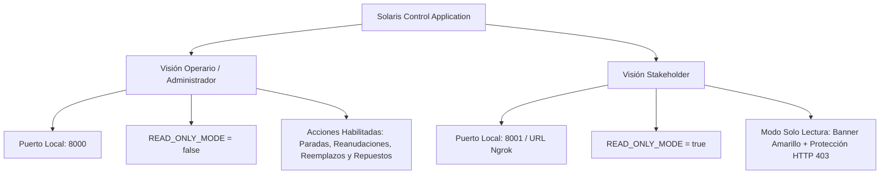

# 02 - Manual de Usuario y Operaciones

> Baúl Obsidian: `modregis` | Sección 02

---

## 👥 Visiones de Usuario del Sistema

La aplicación Solaris Control cuenta con dos perfiles o visiones claramente diferenciadas según el nivel de privilegios y el entorno de ejecución:

---

## 👷 1. Visión de Operario / Administrador

* **Acceso**: `http://localhost:8000`
* **Modo de Operación**: Operaciones Completas (`READ_ONLY_MODE=false`).
* **Público Objetivo**: Personal técnico, operadores de la granja solar y mantenedores de planta.

### Funcionalidades Exclusivas del Operario:
1. **Registrar Paradas de Módulos**: Detener la operación de un módulo de potencia indicando la fecha/hora de falla y la causa inicial.
2. **Registrar Reanudación / Arranque (Diagnóstico Obligatorio)**: Reanudar el funcionamiento de un módulo. Requiere obligatoriamente completar el campo de *Diagnóstico Final / Solución Aplicada*.
3. **Reemplazar Módulos Averiados**: Retirar un módulo defectuoso del inversor e instalar uno nuevo disponible en el inventario de respaldo.
4. **Administración del Inventario de Repuestos**: Agregar, editar seriales o eliminar módulos en stock de respaldo.

---

## 👁️ 2. Visión de Stakeholder (Solo Lectura)

* **Acceso Local**: `http://localhost:8001`
* **Acceso Web Túnel Público**: `https://chiquita-unstructural-maura.ngrok-free.dev`
* **Modo de Operación**: Restringido / Solo Lectura (`READ_ONLY_MODE=true`).
* **Público Objetivo**: Ejecutivos, gerencia, auditoría externa, inversionistas y clientes.

### Características de la Visión Stakeholder:
1. **Banner Prominente de Aviso**:
   En la parte superior de la pantalla se despliega un aviso amarillo fijo indicando:
   > `👁️ ENTORNO DE SOLO LECTURA (STAKEHOLDERS): Las funciones de modificación y registro de reparaciones están restringidas.`

2. **Deshabilitación de Controles Visuales**:
   Todos los botones de acción (`Registrar Parada`, `Registrar Arranque`, `Reemplazar Módulo`, `Eliminar Repuesto`) están deshabilitados o enmascarados, mostrando el aviso: *"Operación no disponible en Modo Solo Lectura (Stakeholders)"*.

3. **Protección Multicapa en Servidor (Seguridad Backend)**:
   Cualquier intento de saltarse la interfaz (por ejemplo, enviando peticiones directas `POST`, `PUT`, `DELETE` mediante Postman, cURL o scripts) es interceptado por el middleware del servidor backend devolviendo inmediatamente la respuesta HTTP:
   `403 Forbidden - Operación no permitida en Modo Solo Lectura.`

---

## 🖥️ Navegación General de la Interfaz

La barra superior en forma de cinta ofrece un acceso rápido a los 4 módulos principales:

1. **Dashboard**: Vista general con KPIs globales (disponibilidad %, inversores activos/detenidos), horas de operación útil (7am-6pm), resumen por inversor y tabla de eventos recientes.
2. **Respaldo**: Gestión del inventario de módulos de repuesto.
3. **Historial**: Reporte detallado de paradas, reanudaciones y reemplazos con filtros avanzados por inversor, serial o estado.
4. **Catálogo**: Registro consolidado de todos los módulos instalados e inventariados.

---

## ⚡ Operaciones en las Tarjetas de Módulos (Vista Operario)

Al seleccionar cualquier inversor desde el Dashboard, se despliega la cuadrícula con sus módulos de potencia. Cada tarjeta cuenta con 3 botones de acción compactos:

| Ícono | Acción | Descripción / Requisito |
| :---: | :--- | :--- |
| `<i class="fa-solid fa-pause">` | **Registrar Parada** | Detiene el módulo indicando motivo y fecha/hora de falla. |
| `<i class="fa-solid fa-play">` | **Registrar Arranque** | **¡REGLA OBLIGATORIA!** Reanuda el módulo exigiendo ingresar un **Diagnóstico Final / Solución Aplicada**. |
| `<i class="fa-solid fa-arrows-rotate">` | **Reemplazar Módulo** | Retira el módulo averiado e instala uno nuevo del inventario de respaldo. |
| `<i class="fa-regular fa-calendar-days">` | **Configurar Fecha Inst.** | Configura la fecha y hora exacta de instalación (`installed_at`), recalculando inmediatamente las horas de operación útiles acumuladas. |
| `<i class="fa-solid fa-clock-rotate-left">` | **Ver Historial** | Redirige al historial filtrando eventos de ese módulo específico. |

---

## 📅 Configuración de Fecha de Instalación y Visibilidad en el Catálogo

> [!TIP]
> **El sistema calcula las horas de operación solar útiles (7:00 AM – 6:00 PM) de forma dinámica a partir de la Fecha de Instalación (`installed_at`) de cada ranura o módulo.**

### Características y Flujo de Trabajo:
1. **Modificación de Fecha de Instalación**: Al hacer clic en el botón `<i class="fa-regular fa-calendar-days">` (disponible tanto en la tarjeta del inversor como en la tabla del catálogo), se abre la ventana modal donde el usuario establece la fecha y hora exacta.
2. **Recálculo Inmediato de Horas**: Al guardar la nueva fecha, el backend recalcula al instante el acumulado de horas operativas netas y la disponibilidad (uptime %) tomando como punto de partida dicha fecha.
3. **Visibilidad Transparente**: 
   - **En Tarjetas de Inversores**: Se muestra la fecha y hora de instalación formateada en el recuadro superior de métricas del slot.
   - **En el Catálogo General**: La tabla consolidada incluye la columna dedicada **Fecha de Instalación**, permitiendo consultar y auditar la fecha histórica de cada módulo registrado.

---

## 🔒 Regla de Negocio: Diagnóstico Obligatorio en Reinicios

> [!IMPORTANT]
> **Ninguna parada o reparación puede finalizarse o reiniciarse sin registrar un diagnóstico técnico final o solución aplicada.**

### Comportamiento del Sistema:
1. **Frontend**: El área de texto *"Diagnóstico Final / Solución Aplicada"* en el formulario de arranque posee el atributo `required` e indicador visual asterisco rojo (`*`). Si se deja vacío, se bloquea el envío y se despliega una notificación Toast.
2. **Backend**: Los endpoints `/api/repairs/restart` y `/api/repairs/restart-inverter` validan que la cadena de texto no esté vacía o compuesta solo por espacios, devolviendo `HTTP 400 Bad Request` en caso contrario.

---

## 🔗 Notas Relacionadas
- [[01 - Guía de Instalación y Despliegue]]
- [[03 - Documentación de API REST]]
- [[04 - Matriz de Pruebas y Validación]]
